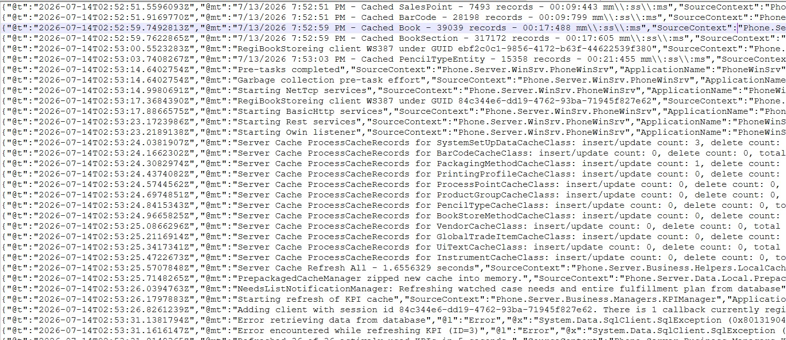
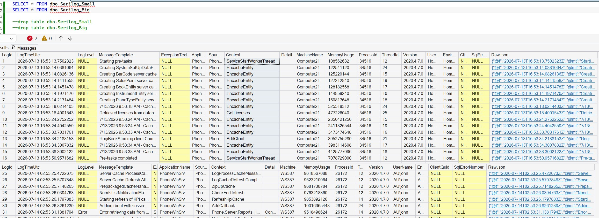
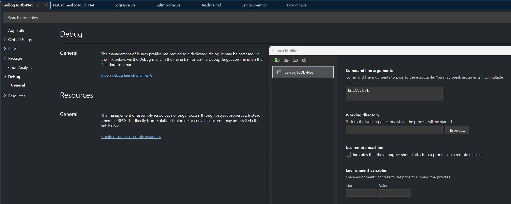
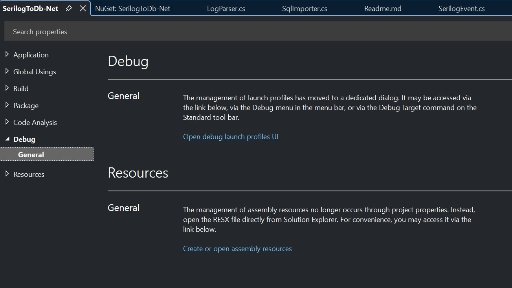

# SerilogToDb-Net

## Overview

**SerilogToDb-Net** is a demo .NET console application that imports Serilog log files (`.txt`) into a Microsoft SQL Server database.

The application is intended for troubleshooting, log analysis, and ad-hoc investigation of large Serilog log files. It parses each JSON log event, extracts commonly used fields into database columns, and stores the complete original JSON payload for future analysis.

For each imported log file, a dedicated SQL table is automatically created using the naming convention:




#### Imported Serilog Tables




```text
Serilog_<FileNameWithoutExtension>
```

Examples:

```text
Small.txt                -> dbo.Serilog_Small
ProductionLog.txt        -> dbo.Serilog_ProductionLog
Server01_20260713.txt    -> dbo.Serilog_Server01_20260713
```

## Features

- Import Serilog JSON log files into SQL Server
- Automatically creates destination tables if they do not exist
- Stores common Serilog properties in searchable columns
- Stores the complete original JSON payload in `RawJson`
- Supports bulk insert operations
- Creates useful indexes for log analysis

## Expected Log Format

The application expects one JSON object per line:

```json
{"@t":"2026-07-13T16:53:13.7502323Z","@mt":"Starting pre-tasks","ApplicationName":"PhoneWindowsService"}
```

Each line must start with `{` and end with `}`.

## Database Schema

Each imported file creates a table named:

```sql
dbo.Serilog_Small
```

Columns include:

- LogId
- LogTimeUtc
- LogLevel
- MessageTemplate
- ExceptionText
- ApplicationName
- SourceContext
- Context
- Detail
- MachineName
- MemoryUsage
- ProcessId
- ThreadId
- Version
- UserName
- EnvironmentUserName
- ClientGuid
- SqlErrorNumber
- RawJson

## Running the Application

```text
SerilogToDb-Net.exe Small.txt
```

or

```text
SerilogToDb-Net.exe C:\Logs\Small.txt
```

## Running from Visual Studio

1. Right-click the project.
2. Open **Properties**.
3. Open **Debug**.
4. Click **Open debug launch profiles UI**.
5. Enter a startup argument:

```text
Small.txt
```

#### Visual Studio Debug Launch Profile



#### Visual Studio Debug




## Connection String

Configure `appsettings.json`:

```json
{
  "ConnectionStrings": {
    "LogsDb": "Server=.;Database=Logs;Trusted_Connection=True;TrustServerCertificate=True;"
  }
}
```

## Example Queries

Latest errors:

```sql
SELECT TOP 100 *
FROM dbo.Serilog_Small
WHERE LogLevel = 'Error'
ORDER BY LogTimeUtc DESC;
```

Highest memory usage:

```sql
SELECT TOP 100 *
FROM dbo.Serilog_Small
ORDER BY MemoryUsage DESC;
```

## Requirements

- .NET 8+
- SQL Server 2019+
- Microsoft.Data.SqlClient
